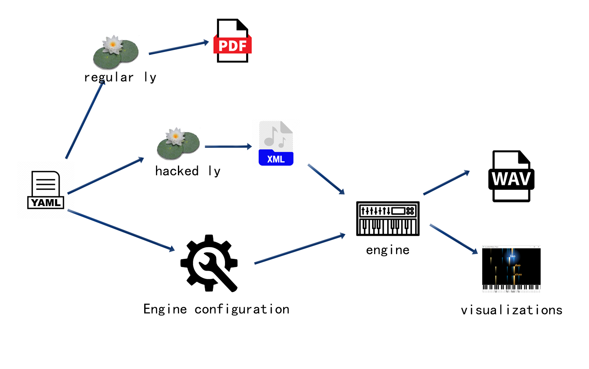

# ScoreDraft 使用说明

ScoreDraft 源代码位于 [GitHub](https://github.com/fynv/ScoreDraft)，那里你总是可以找到我最新提交的修改。

可通过以下命令下载 PyPi 包，支持64位 Windows 和 Linux.

```
pip install scoredraft
```

此处文档将介绍ScoreDraft各个基本元素的使用。

## HelloWorld (使用TrackBuffer)

我们就由一个最简单的例子入手来介绍ScoreDraft 的基本使用和设计思想。

```python
import ScoreDraft
from ScoreDraft.Notes import *

seq=[do(),do(),so(),so(),la(),la(),so(5,96)]

buf=ScoreDraft.TrackBuffer()
ScoreDraft.KarplusStrongInstrument().play(buf, seq)
ScoreDraft.WriteTrackBufferToWav(buf,'twinkle.wav')
```

<audio controls>
    <source type="audio/mpeg" src="twinkle.mp3"/>
</audio>

<h3>Play命令</h3>

```python
ScoreDraft.KarplusStrongInstrument().play(buf, seq)
```

ScoreDraft最重要的接口设计，是一类我们后面称为Play命令的语句，它的基本形式是 

```python
instrument.play(buf,seq)
```

其中，instrument是乐器，buf是音轨缓存，seq是序列。整句话代表用乐器instrument演奏序列seq，结果写入buf。

与此类似的，还可以用打击乐组来演奏，或用（虚拟）歌手来演唱，这些语句都具有与这里类似的形式，统称为Play命令。

Play命令还可以传入速率（tempo）、参考频率（refFreq）等信息，它们有默认值，因此可以省略。

### 导入

```python
import ScoreDraft
from ScoreDraft.Notes import *
```

使用ScoreDraft必须首先导入ScoreDraft包，该包定义了ScoreDraft的核心Python 接口。

多数应用也会包含ScoreDraft.Notes 模块中的音符定义。这里要注意一个事实，那就是，音符定义并不是ScoreDraft核心接口的一部分。对于音符的音高，核心接口直接接受的是物理频率。具体来说，在每一个Play命令中，我们可以传入一个以Hz为单位的参考频率，此处记为f_ref，然后对每一个音符，我们指定一个无量纲的相对频率f_rel[i]，此时音符的物理频率可由以下公式计算得到：

```
f_note[i] = f_ref *f_rel[i].
```

ScoreDraft.Notes给出了一系列“音符”函数（do(), re(), mi()...）的定义，帮助我们把音乐语言转换为物理量。这些函数都十分简单，这使得用户可根据自己的需要在必要的时候对其进行修改和扩展，比如，当你需要一个不同于十二平均律的律制的时候。

### 乐谱的表示

```python
seq=[do(),do(),so(),so(),la(),la(),so(5,96)]
```

乐谱本体在ScoreDraft中表示为一组Python列表，称为“序列”。后面的章节会详细介绍这些序列的组成规则。尽管序列的各个元素是按顺序依次处理的，由这些元素产生的声音却有可能彼此重合，这是通过在序列中包含退格操作来实现的。

因为序列的本质是Python列表，原则上我们可以使用Python提供的任何功能来辅助我们编写音乐的过程。这方面的技巧可能需要另外的文档来专门介绍。

### 音轨缓存(TrackBuffer)

```python
buf=ScoreDraft.TrackBuffer()
```

ScoreDraft 用音轨缓存来储存波形数据，不论是音乐合成的中间结果还是最终的混音结果都储存在音轨缓存当中。

在ScoreDraft包中定义有TrackBuffer类，它是对C++接口的直接封装，相对于后面要介绍的Document类，TrackBuffer类是较为底层的操作接口。

## HelloWorld (使用Document)

```python
import ScoreDraft
from ScoreDraft.Notes import *

doc=ScoreDraft.Document()

seq=[do(),do(),so(),so(),la(),la(),so(5,96)]

doc.playNoteSeq(seq, ScoreDraft.KarplusStrongInstrument())
doc.mixDown('twinkle.wav')
```

多数音乐作品需要复数个音轨缓存(TrackBuffer)。ScoreDraft包中提供了一个Document类，用来统一管理多个音轨缓存，在实际使用中，我们建议使用ScoreDraft.Document类，而不是直接使用音轨缓存对应的ScoreDraft.TrackBuffer类。

如上面的例子所示， 使用Document类代替TrackBuffer类同时伴随着Play命令写法的变化。使用Document的Play命令时隐含了TrackBuffer对象，同时乐器变为参数。可以形式化地写为doc.play(seq,instrument)，代替了instrument.play(buf,seq)。

这样做有几个好处。首先，它简化了音轨缓存的创建，Document类会在执行Play命令时帮你隐式地完成这件事。第二，它大大地简化了混音操作，由于音轨全部在Document类内管理，在混音的时候不必手动列举需要混合的各个音轨。第三，可视化插件可以在Document类上做文章来实现多态性。比如在使用Meteor可视化器的时候，最简单的做法就是把ScoreDraft.Document类用Meteor.Document类来替换。

使用Document类时，速率、参考频率等信息也由Document的实例对象统一管理，不再需要通过Play命令的参数来传入。

## 初始化 Intruments/Percussions/Singers

用户随时可以通过 PrintCatalog.py 来得到一个可以全部乐器/打击
乐/歌手初始化器的列表：

```python
# PrintCatalog.py
import ScoreDraft
ScoreDraft.PrintCatalog()
```

该脚本的输出类似于如下的效果：

```
{
  "Engines": [
    "KarplusStrongInstrument - Instrument",
    "InstrumentSampler_Single - Instrument",
    "InstrumentSampler_Multi - Instrument",
    "PercussionSampler - Percussion",
    "SF2Instrument - Instrument",
    "UtauDraft - Singing"
  ],
  "Instruments": [
    "Ah - InstrumentSampler_Single",
    "Cello - InstrumentSampler_Single",
    "CleanGuitar - InstrumentSampler_Single",
    "Lah - InstrumentSampler_Single",
    "String - InstrumentSampler_Single",
    "Violin - InstrumentSampler_Single",
    "Arachno - SF2Instrument",
    "SynthFontViena - SF2Instrument"
  ],
  "Percussions": [
    "BassDrum - PercussionSampler",
    "ClosedHitHat - PercussionSampler",
    "Snare - PercussionSampler",
  ],
  "Singers": [
    "Ayaka_UTAU - UtauDraft",
    "GePing_UTAU - UtauDraft",
    "jklex_UTAU - UtauDraft",
    "uta_UTAU - UtauDraft",
  ]
}
```

第一个列表"Engines"列出的是各个可用的引擎以及它们的类型（乐器/打击乐/歌手）。

后续的三个列表分别给出可以立即使用的乐器/打击乐/歌手初始化器和它们所基于的引擎。ScoreDraft在启动时，根据脚本运行的位置搜索特定的几个目录来建立乐器采样、音源库的索引，并自动创建上面这些初始化器。这些初始化器的声明是动态代码块，在代码中是找不到的，但是使用却很方便，例如，您可以通过下面的代码来初始化一个大提琴乐器：

```python
Cello1 = ScoreDraft.Cello()
```

### 乐器采样器

乐器采样器引擎使用1个或多个wav文件作为样本来构造乐器。wav文件必须是1个或2个通道的16bit PCM格式。乐器采样器的算法是通过对样本的简单拉伸来改变音高的。因此使用的音频样本应具有足够的长度。

#### 单采样

用户可以使用ScoreDraft.InstrumentSampler_Single类来直接创建一个乐器，在创建时需要给出wav文件的路径，该路径或是绝对路径，或是相对于启动目录：

```python
flute = ScoreDraft.InstrumentSampler_Single('c:/samples/flute.wav')
```

你也可以把wav文件布署到启动位置下的**InstrumentSamples**目录中，这样ScoreDraft 就可以自动为你创建一个初始化器。去掉扩展名的文件名将作为初始化器的名字出现在PrintCatalog列表当中。

#### 多采样

用户可以使用ScoreDraft.InstrumentSampler_Multi类来直接创建一个乐器，在创建的时候需要给出一个包含全部用到的wav文件的目录路径。这些音频样本应覆盖一定的音高范围。 采样器将通过在这些音高之间基于目标音高来插值得到最终的合成结果。

你也可以在**InstrumentSamples**目录下建立一个子目录来布署这些wav文件。，这样ScoreDraft 就可以自动为你创建一个初始化器。新建的子目录名将作为初始化器的名字出现在PrintCatalog列表当中。

### SoundFont2 乐器

ScoreDraft 包含一个 SoundFont2 引擎。你可以通过**ScoreDraft.SF2Instrument**类来加载SoundFont音源。在使用ScoreDraft.SF2Instrument类创建一个乐器时，用户需要给出.sf2文件的路径，以及想要使用的preset的编号。

```python
piano = ScoreDraft.SF2Instrument('florestan-subset.sf2', 0)
```

函数ScoreDraft.ListPresetsSF2()可以用来得到一个.sf2文件中全部preset的列表：

```python
ScoreDraft.ListPresetsSF2('florestan-subset.sf2')
```

你也可以把.sf2文件布署到启动位置下的**SF2**目录中，这样ScoreDraft 就可以自动为你创建一个初始化器。去掉扩展名的文件名将作为初始化器的名字出现在PrintCatalog列表当中。因为我们还需要知道使用哪个preset, 在使用这个初始化器的时候依然需要一个preset_index参数。

SoundFont2 的支持来自于对TinySoundFont(https://github.com/schellingb/TinySoundFont)项目的移植，在此对作者Bernhard Schelling 表示感谢！

### 打击乐采样器

打击乐采样器引擎使用1个wav文件来构造打击乐器，wav文件必须是1个或2个通道的16bit PCM格式。打击乐采样器在使用样本时不做任何修改，直接添加包络。因此使用的音频样本应具有足够的长度。

用户可以使用ScoreDraft.PercussionSampler类来直接创建一个打击乐器，在创建时需要给出wav文件的路径：

```python
drum = ScoreDraft.PercussionSampler('./Drum.wav')
```

你也可以把wav文件布署到启动位置下的**PercussionSamples**目录中，这样ScoreDraft 就可以自动为你创建一个初始化器。去掉扩展名的文件名将作为初始化器的名字出现在PrintCatalog列表当中。

### UtauDraft 引擎

UtauDraft 引擎使用一个UTAU的音源目录来生成歌手。

用户可以通过ScoreDraft.UtauDraft类来直接创建歌手，创建的时候需要给出UTAU音源的路径，同时可以给出一个bool值指定是否使用CUDA加速，该值默认为真，系统会在CUDA可以使用的情况下自动使用CUDA加速。如果需要禁用CUDA加速，则需传入一个"False":

```python
cz = ScoreDraft.UtauDraft('d:/CZloid', False)
```

你也可以把音源目录布署到启动位置下的**UTAUVoice**目录中，这样ScoreDraft 就可以自动为你创建一个初始化器。音源目录名将作为初始化器的名字出现在PrintCatalog列表当中。如果音源目录原来的名字不适合用作Python的变量名，那么用户应对目录名进行必要的修改以避免发生Python解析错误。

## 乐器演奏

用于乐器演奏的序列称为Note序列，Note序列中的元素是具有(rel_freq, duration) 形式的Python元组, rel_freq是浮点数，duration是整数.

例子：

```python
seq=[(1.0, 48), (1.25, 48), (1.5,48)]
```

使用一个已有的Document对象 "doc"和某个乐器实例, 你可以像下面这样来演奏一个Note序列:

```python
doc.playNoteSeq(seq, ScoreDraft.Piano())
```

<audio controls>
    <source type="audio/mpeg" src="DoMiSo.mp3"/>
</audio>

浮点数rel_freq表示一个相对于当前Document参考频率的相对频率, Document的参考频率可以通过doc.setReferenceFreqeuncy()来设置，默认为261.626，单位是Hz.
音长duration使用48代表一拍，在Document中可以通过doc.setTempo()设置速率，默认为80，单位为拍/秒。对于doc.setTempo()，也可以传入一组控制点，见“动态速率映射”部分。

使用ScoreDraftNotes时，音符可以用较为直观的方式表示为：

```python
seq=[do(5,48), mi(5,48), so(5,48)]
```

七个音符函数 (do(),re(),mi(),fa(),so(),la(),ti()) 各自有两个整数参数，八度号octave和时长duration。时长值会直接pass给输出的元组，而相对频率rel_freq则由octave和音符函数本身决定。
octave=5代表中心八度，因此do(5,48)的相对频率为1.0，而do(4,48)的相对频率为0.5。

当rel_feq小于0时，该音符会被解释为一个特殊操作。取决于duration大于0或小于0，大于0时代表一个空拍，小于0时代表一个退格。 ScoreDraftNotes提供了两个函数BL(duration)和BK(duration)来生成这两个音符。退格功能非常有用，它使我们可以把多个音符叠加起来构成和弦，例如，下面是一个大三和弦：

```python
seq=[do(5,48), BK(48), mi(5,48), BK(48), so(5,48)]
```

<audio controls>
    <source type="audio/mpeg" src="DoMiSo2.mp3"/>
</audio>

## 打击乐演奏

对于打击乐演奏，首先您应该考虑选择哪些打击乐器来组成一个打击乐组。 例如，我选择低音鼓和小军鼓：

```python
BassDrum=ScoreDraft.BassDrum()
Snare=ScoreDraft.Snare()    
perc_list= [BassDrum, Snare]
```

用于打击乐演奏的序列称为Beat序列，Note序列中的元素是具有(percussion_index, duration) 形式的Python元组, 两个参数都是整数。percussion_index用来指示前面打击乐组中的某件打击乐器，duration与乐器演奏中的duration是相同概念。

通常，我们会定义几个辅助函数来使Beat序列的编写变得直观：

```python
def dong(duration=48):
    return (0,duration)

def ca(duration=48):
    return (1,duration)
```

使用上面两个函数，我们就可以用下面的方式来编写Beat序列了：

```python
seq = [dong(), ca(24), dong(24), dong(), ca(), dong(), ca(24), dong(24), dong(), ca()]
```

使用一个已有的Document对象 "doc"和打击乐组, 你可以像下面这样来演奏一个Beat序列:

```python
doc.playBeatSeq(seq, perc_list)
```

<audio controls>
    <source type="audio/mpeg" src="test_perc.mp3"/>
</audio>

## 唱歌

ScoreDraft 提供的唱歌界面与乐器/打击乐演奏界面比较类似。用于唱歌的序列称为Singing序列，它比Note序列要稍微复杂一些。例如：

```python
seq=[('yi',do(),'shan',do(),'yi',so(),'shan',so(),'liang',la(),'jing',la(),'jing',so(5,72)), BL(24) ]
seq+=[('man',fa(),'tian',fa(),'dou',mi(),'shi',mi(),'xiao',re(),'xing',re(),'xing',do(5,72)), BL(24) ]
```

每个“歌唱片段”（由逗号分隔的第一级元组）包含一个或多个作为歌词的字符串。每个歌词后可以跟一个或多个元组，用来定义该歌词对应的音高。这些元组在最简单的情况下可以是和乐器音符相同的 (freq_rel, duration) 的形式。一个元组也可以包含更多的freq_rel/duration对，如(freq_rel1, duration1, freq_rel2, duration2, ...)，此时则定义了多个控制点, 控制点和控制点之间音高线性过渡，最后一个控制点之后的区间音高保持水平。元组之间不做音高插值。使用**ScoreDraft.Notes**，你可以把多个乐器音符用“+”连接，来构造一个音高折线，如do(5,24)+so(5,24)+do(5,0)，该音高折线有三个控制点，总时值为48。

每个“歌唱片段”内的所有音节（歌词＋音符）都应连续演唱，除非遇到空拍 BL() 或倒退 BK()，那时系统将不得不把把一个歌唱片段分解成多个歌唱片段来处理。使用一个已有的Document对象 "doc"和某个歌手，歌唱命令类似下面这样：

```python
doc.sing(seq, ScoreDraft.GePing_UTAU())
```

<audio controls>
    <source type="audio/mpeg" src="GePing.mp3"/>
</audio>

分段线性的音高表示可以用来模拟rap。在ScoreDraft.RapChinese模块中提供了一个工具函数CRap()，可以用来帮助生成中文四声的Rap。使用实例如：

```python
seq= [ CRap("chu", 2, 36)+CRap("he", 2, 60)+CRap("ri", 4, 48)+CRap("dang", 1, 48)+CRap("wu", 3, 48), BL(24)]
```

<audio controls>
    <source type="audio/mpeg" src="rap2.mp3"/>
</audio>

### UtauDraft 引擎

UtauDraft 引擎试图尽可能支持UTAU的各种音源，包括单独音，连续音，VCV, CVVC等。引擎会读取音源 的oto.ini和.frq来提取音源的特征。如果有prefix.map，引擎也会读取这个文件来进行样本音高的选择。

当使用 UtauDraft 引擎时，歌唱片段中使用的歌词应以oto.ini中的定义为准，正如在UTAU中那样。使用单独音音源时，我们只需要直接使用这些歌词。

当使用VCV或CVVC等类型的音源时，为了正确处理音节之间的过渡，同时简化歌词输入，用户需要选择一个拆音函数来使用。ScoreDraft目前提供了以下的拆音函数：

ScoreDraft.CVVCChineseConverter: for CVVChinese
ScoreDraft.XiaYYConverter: for XiaYuYao style Chinese
ScoreDraft.JPVCVConverter: for Japanese 連続音
ScoreDraft.TsuroVCVConverter: for Tsuro style Chinese VCV
ScoreDraft.TTEnglishConverter: for Delta style (Teto) English CVVC
ScoreDraft.VCCVEnglishConverter: for CZ style VCCV English

拆音函数的使用方法如下所示, 只需调用singer.setLyricConverter(converter)即可：

```python
import ScoreDraft
Ayaka = ScoreDraft.Ayaka_UTAU()
Ayaka.setLyricConverter(ScoreDraft.CVVCChineseConverter)
```

当使用CZ VCCV音源时，还需要调用一下singer.setCZMode()，让引擎使用特殊的方式来进行映射。

拆音函数应具有以下的形式，如果上面列出的拆音函数无法满足需求，用户可以尝试编写自己的拆音函数：

```python
def LyricConverterFunc(LyricForEachSyllable):
    ...
    return [(lyric1ForSyllable1, weight11, isVowel11, lyric2ForSyllable1, weight21, isVowel21...  ),(lyric1ForSyllable2, weight12, isVowel12, lyric2ForSyllable2, weight22, isVowel22...), ...]
```

输入参数'LyricForEachSyllable' 是歌唱片段中输入的歌词列表 [lyric1, lyric2, ...], 每个歌词 对应一个音节。拆音函数将每个输入歌词转换为1个或多个歌词，来瓜分原歌词的时值。输出的时候，要给每个 分解后的歌词设置一个权重，以指示分解后的歌词在原歌词的时值中所占的比例。另外还需要提供一个bool值isVowel表示分离出来的这个部分是否包含原音节的元音部分。

## 动态速率映射

```
tempo_map=[(beat_position_1, dest_position_1), (beat_position_2, dest_position_2), ...]
```

用它来取代play()命令中的整数tempo, 可以将生成的音频精确地对齐到时间轴上。

以上，beat_position_i 为整数，代表被演奏序列中的一个位置，它的单位和duration相同，48代表一拍。

dest_position_i 为浮点数，代表生成音频的时间点，单位是毫秒。注意这里采用的是时间轴上的绝对位置。

当tempo_map中存在beat_position_1=0时，生成的音频的起始点会自动对齐到dest_position_1。

当tempo_map中不存在beat_position_1=0时，生成的音频的起始点以音轨缓存当前的光标位置为准。

对于 beat_position_i， 通常我们建议使用ScoreDraft.TellDuration(seq)，通过测量序列的长度，方便地得到 beat_position_i 的值。

对于 dest_position_i ，通常需要手动测量待对齐的音频（或视频）内容来得到。

例子：

```python
seq=[do(),do(),so(),so(),la(),la(),so(5,96)]
buf = ScoreDraft.TrackBuffer()
piano = ScoreDraft.Piano()
tempo_map = [ (0, 1000.0), (ScoreDraft.TellDuration(seq), 5000.0) ]
piano.play(buf, seq, tempo_map)
```

以上代码在生成音频时，会把音频的起点和终点精确对齐到1s和5s处。

## 回放和可视化

ScoreDraft 目前提供两个播放器/可视化模块。

### PCMPlayer

ScoreDraft.PCMPlayer 可以用来播放一个之前生成的TrackBuffer对象buf，可以显示窗口也可以不显示窗口。

无窗口模式：

```python
player = ScoreDraft.PCMPlayer()
player.play_track(buf)
```

这里play_track()是异步调用，这意味着这个函数在启动音频播放之后会立刻返回Python代码执行。 此时你可以继续提交新的播放。所有提交的音轨会组成队列依次播放。

有窗口模式：

```python
player = ScoreDraft.PCMPlayer(ui = True)
player.play_track(buf)
player.main_loop()
```

ui=True时必须要调用main_loop()来实现窗口交互响应，但是这样一来成了同步调用了。如果需要异步调用的话，则应使用ScoreDraft.AsyncUIPCMPlayer：

```python
player = ScoreDraft.AsyncUIPCMPlayer()
player.play_track(buf)
```

或者更简单地：

```python
ScoreDraft.PlayTrackBuffer(buf)
```

<image src ="PCMPlayer1.png"/>
<image src ="PCMPlayer2.png"/>

PCMPlayer 支持两种可视化模式，按“W”显示波形，按“S”显示频谱。

### Meteor

Meteor 可以用来可视化前面介绍过的各种序列，同时播放混合好的音轨。使用Meteor最简单的方法是用ScoreDraft.MeteorDocument代替ScoreDraft.Document来使用，该类包含ScoreDraft.Document中的所有接口，外加一个额外的方法 MeteorDocument.meteor(chn=-1). 如果你在旧的项目中使用ScoreDraft.Document，你只需要用ScoreDraft.MeteorDocument来替换它，然后在代码最后调用doc.meteor() 可视化器将会被激活。与 PlayTrackBuffer()不同，doc.meteor()是同步调用，代码会暂停执行，直到播放结束。

<image src ="Meteor.png"/>

## MusicXML 和 LilyPond 支持

ScoreDraft 通过 **class MusicXMLDocument** 支持MusicXML和LilyPond格式的输入。可以由一个MusicXML文件或LilyPond文件创建该对象。MusicXML:

```pythonag-0-1flafg1ldag-1-1flafg1ldag-0-1flafg1ldag-1-1flafg1ld
doc = ScoreDraft.from_music_xml('xyz.xml')
```

LilyPond:

```python
doc = ScoreDraft.from_lilypond('xyz.ly')
```

方法 **playXML()** 用于将音符播放到音轨当中：

```python
instruments = [ScoreDraft.Piano()]
doc.playXML(instruments)
```

每个乐器对应于一个音轨（一行音符），当乐器数比音轨数少时，最后一个乐器会被使用多次。

**MusicXMLDocument** 对象可以像其他文档对象一样使用，默认支持meteor.

## 基于 YAML 格式的输入

我们可以看出，使用 LilyPond 进行输入，相比于用 Python 录入序列要更为简洁、容易。但是，LilyPond 的语法非常复杂，解析起来并不容易。前面的例子中，ScoreDraft 在内部使用了 python_ly 库，把 ly 转换成 MusicXML，再读取 MusicXML 进行合成。这个转换过程并不是很可靠，遇到复杂的 ly 文件会出问题。此外，还有一些对于合成过程有用的信息，是无法包含在 LilyPond 和 MusicXML 文件当中的，导致我们还需要在Python代码中对引擎进行一些额外的设置。

显然，我们可以在“人类可读性”和“机器可读性”中间寻求某种折中。这里提出一种方案，使用 YAML 作为外层结构描述，并内嵌 LilyPond 代码片段来输入音符。这样折中之后，我们就可以把音乐合成所需的全部信息放入到一个YAML文件中。

```yaml
# exmaple 1
score:
    tempo: 150
    staffs:
        - 
            relative: c''
            instrument: Arachno(40)
            content: |
                r4 g c d 
                e2 e2
                r4 e dis e
                d2 c2
                r4 c d e
                f2 a2
                r4 a g f
                e2. r4
        -
            relative: c
            instrument: Arachno(0)
            content: |
                \clef "bass"
                c g' <c e> g
                c, g' <bes e> g
                c, g' <bes e> g
                f c' <e a> c
                f, c' <e a> c
                g d' <f b> d
                g, d' <f b> d
                c, g' <b e>2
```

<audio controls>
    <source type="audio/mpeg" src="example1.mp3"/>
</audio>

score 是最顶层对象，包含全部内容。第二层包括全局设置和 staffs 列表。

每个 staff 定义一行音符，以及如何合成这行音符。instrument 属性告诉 Python 如何初始化用来合成这行音符的乐器。它的值本身是有效的Python代码，ScoreDraft在内部会使用exec() 来执行这个代码。这里 Arachano 是一个 SoundFont2 音色库，我们事先把它部署在 SF2 目录下面。括号内的编号代表音色序号，如40号是小提琴，0号是钢琴。

content 是一个多行字符串，主要包含LilyPond音符。

从版本 1.0.3 开始，加入了一个命令行指令 scoredraft，用来处理 YAML 输入。用法如下：

```
usage: scoredraft [-h] [-ly LY] [-wav WAV] [-meteor METEOR] [-run] yaml

positional arguments:
  yaml            input yaml filename

optional arguments:
  -h, --help      show this help message and exit
  -ly LY          output lilyond filename
  -wav WAV        output wav filename
  -meteor METEOR  output meteor filename
  -run            run meteor
```

使用 -ly 参数，可以把YAML文件转成一个正常的 LilyPond 文件，可以进一步完善后发布。除了音符以外的更多信息则将会传递给合成引擎用于合成过程，而这些信息大多不会记录在LilyPond文件中。



上图显示了 scoredraft 内部的工作流程。从原理上，只要是对合成过程有用的信息我们都可以把它包含到 YAML 文件里。例如，可以用如下方法加入踏板控制信息：

```yaml
# exmaple 2
score:
    tempo: 150
    staffs:
        - 
            relative: c''
            instrument: Arachno(40)
            content: |
                r4 g c d 
                e2 e2
                r4 e dis e
                d2 c2
                r4 c d e
                f2 a2
                r4 a g f
                e2. r4
        -
            relative: c
            instrument: Arachno(0)
            content: |
                \clef "bass"
                c g' <c e> g
                c, g' <bes e> g
                c, g' <bes e> g
                f c' <e a> c
                f, c' <e a> c
                g d' <f b> d
                g, d' <f b> d
                c, g' <b e>2

            pedal: |
                bd1
                bd1
                bd1
                bd1
                bd1
                bd1
                bd1
                bd1
```

<audio controls>
    <source type="audio/mpeg" src="example2.mp3"/>
</audio>

LilyPond 其实是有专门的踏板指令的，但是没有工具可以可靠地把这个信息转换成 MusicXML。因此，在YAML中我们用一个打击乐序列来表示踏板的运动，这里bd本来是用来表示底鼓的，使用其他打击乐也没有问题，毕竟踏板只需要一个开关信息。

在吉他轨中，我们经常希望在和弦音中加入一个微小的延迟，用来模拟扫弦效果。在YAML中我们只要加入一个sweep属性就可以在合成过程中自动模拟这个效果。

```yaml
# exmaple 3
score:
    tempo: 150
    staffs:
        - 
            relative: c''
            instrument: Arachno(40)
            content: |
                r4 g c d 
                e2 e2
                r4 e dis e
                d2 c2
                r4 c d e
                f2 a2
                r4 a g f
                e2. r4
        -
            relative: c
            instrument: Arachno(24)
            sweep: 0.1
            content: |
                \clef "bass"
                c4 e <g c e>2
                c,4 e <g bes e>2
                c,4 e <g bes e>2
                f,4 a <e' a c>2
                f,4 a <e' a c>2
                g,4 b <d g b>2
                g,4 b <d g b>2
                c4 e <g b e>2
```

<audio controls>
    <source type="audio/mpeg" src="example3.mp3"/>
</audio>

sweep: 0.1 告诉 ScoreDraft 在和弦音中加入10% 的延迟。

要加入打击乐的话，只需要设置 is_drum: true，然后就可以在 content 里使用打击乐音符了。

```yaml
# exmaple 4
score:
    tempo: 150
    staffs:
        - 
            relative: c''
            instrument: Arachno(40)
            content: |
                r4 g c d 
                e2 e2
                r4 e dis e
                d2 c2
                r4 c d e
                f2 a2
                r4 a g f
                e2. r4
        -
            relative: c
            instrument: Arachno(24)
            sweep: 0.1
            content: |
                \clef "bass"
                c4 e <g c e>2
                c,4 e <g bes e>2
                c,4 e <g bes e>2
                f,4 a <e' a c>2
                f,4 a <e' a c>2
                g,4 b <d g b>2
                g,4 b <d g b>2
                c4 e <g b e>2

        -
            is_drum: true
            instrument: Arachno(128)
            content: |
                bd4 hh sn hh
                bd hh sn hh
                bd hh sn hh
                bd hh sn hh
                bd hh sn hh
                bd hh sn hh
                bd hh sn hh
                bd hh sn hh
```

<audio controls>
    <source type="audio/mpeg" src="example3.mp3"/>
</audio>

对于鼓轨来说，instrument 必须是一个GM鼓乐器，如我们这里设置的 Arachno(128)。

歌唱合成也可以在YAML中进行编写。

```yaml
# example 5
score:
    tempo: 150
    staffs:
        -
            relative: c'
            is_vocal: true
            singer: TetoEng_UTAU()
            converter: TTEnglishConverter            
            content: |
                r4 g c d 
                e2 e2
                r4 e dis e
                d4 (c) c2
                r4 c d e
                f2 g4 (a)
                r4 a g f
                e2. r4
            utau: |
                ju Ar maI
                s@n SaIn.
                maI oU nli
                s@n SaIn.
                ju meIk mi
                h{p i.
                wEn skaIz Ar
                greI.

        -
            relative: c
            instrument: Arachno(0)
            content: |
                \clef "bass"
                c g' <c e> g
                c, g' <bes e> g
                c, g' <bes e> g
                f c' <e a> c
                f, c' <e a> c
                g d' <f b> d
                g, d' <f b> d
                c, g' <b e>2

            pedal: |
                bd1
                bd1
                bd1
                bd1
                bd1
                bd1
                bd1
                bd1

        -
            is_drum: true
            instrument: Arachno(128)
            content: |
                bd4 hh sn hh
                bd hh sn hh
                bd hh sn hh
                bd hh sn hh
                bd hh sn hh
                bd hh sn hh
                bd hh sn hh
                bd hh sn hh
```

首先，设置 is_vocal: true。第二，设置一个 singer 属性代替 instrument 属性。在多数情况下，还要设置一个converter属性来设置歌词转换器。如果使用的是CZ式VCCV的话，还需要设置 CZMode: true。第三，添加一个 utau 属性来加入音标。音节之间用空格分隔，每句话结尾加一个点。除了这个句尾点之外，content 代码中的休止符 r 也标志着一句话的结束。每个音节默认对应一个音符，如果需要对应多个音符则需要加入连音线。

### 属性参考

目前，ScoreDraft 在 YAML 格式中识别的属性并不多，上面基本上都提到了。这里给出一个完整的列表。

#### score

顶层对象

#### tempo

全局属性，定义速率，单位BPM

#### staffs

音轨表

#### content

音轨属性，包含嵌入的LilyPond代码。原则上可以包含任何 LilyPond 代码。在使用 -ly 命令行参数时，这些代码会被直接输出到 ly 文件中。但是，对于合成器来说，只有一小部分 LilyPond 语法是有意义的。除了基本的音符之外，<> 和弦标记和 ()连音标记会被识别。连音标记对于歌唱合成有用。

#### is_drum

音轨属性，表示当前音轨是否是鼓轨。

#### is_vocal

音轨属性，表示当前音轨是否是歌声。

当 is_drum 和 is_vocal 都没有被设置时，当前轨默认为乐器轨。

#### relative

音轨属性，用于乐器和歌唱轨，表示 content 里的音符是相对模式。

#### instrument

音轨属性，用于乐器和鼓轨，表示乐器信息。

属性值应为用来调用乐器初始化器所需的 Python 代码。

对于鼓轨，该乐器应为GM鼓乐器。

#### pedal

音轨属性，用于乐器轨中控制延音踏板。属性值用打击乐的语法来编写，可以使用任何一种打击乐音符。支持休止符。

#### sweep

音轨属性，用于乐器轨中，为和弦音添加一个延迟来模拟吉他扫弦效果。

#### singer

音轨属性，用于歌唱轨中，表示歌手信息。

属性值应为用来调用歌手初始化器所需的Python代码。

#### converter

音轨属性，用于歌唱轨中，提供歌词转换器信息。

属性值应为该歌词转换器的 Python 变量名。

#### CZMode

音轨属性，用于歌唱轨中，表示当前歌手是否是CZ VCCV模式的。

#### utau

音轨属性，用于歌唱轨中，包含每个音节的 UTAU 音标。音节用空格分隔，句尾加一个点。
